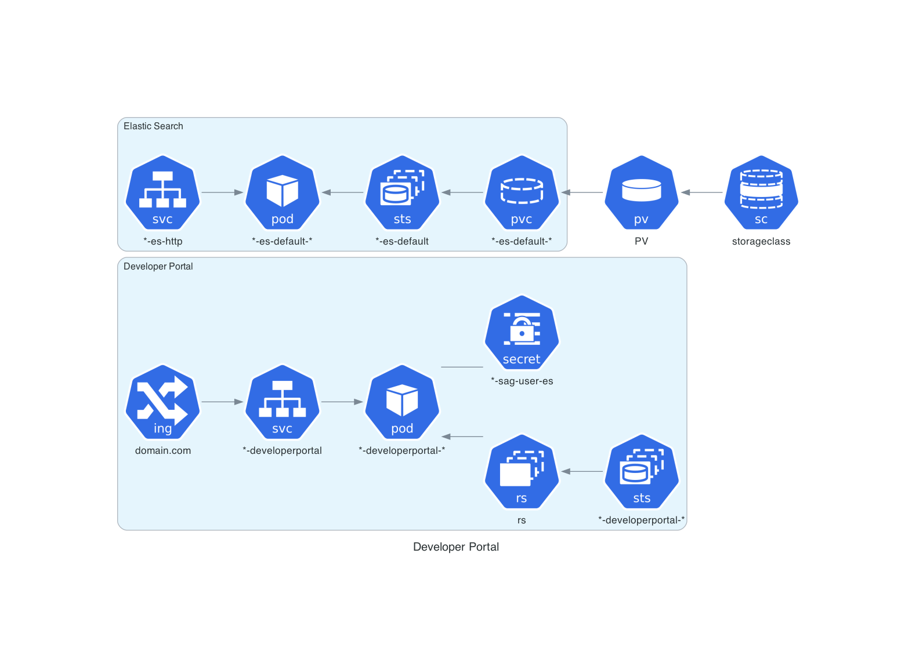

# webMethods Developer Portal Helm Chart

This Helm Chart installs and configures a webMethods Developer Portal container.

## Default deployment



## Prerequisites

### ECK / Elasticsearch

This deployment uses the ECK Operator to deploy Elasticsearch. You can use Helm to deploy the operator with the following commands:

#### Register the Elasticsearch Helm Repository

```
helm repo add elastic https://helm.elastic.co
helm repo update
```

#### Install ECK (Cluster-wide)

```
helm install elastic-operator elastic/eck-operator -n elastic-system --create-namespace
```

For more information please see: https://www.elastic.co/guide/en/cloud-on-k8s/current/k8s-install-helm.html

### Image Pull Secret

If you want to pull image from [Software AG Containers Registry](https://containers.softwareag.com), create secret with your Software AG Containers Registry credentials ...

```
kubectl create secret docker-registry regcred --docker-server=sagcr.azurecr.io --docker-username=<your-name> --docker-password=<your-pwd> --docker-email=<your-email>
```

## Install Developer Portal Release

```
helm install webmethods/developerportal devportal
```

## Values

| Key | Type | Default | Description |
|-----|------|---------|-------------|
| affinity | object | `{}` |  |
| autoscaling.enabled | bool | `false` |  |
| autoscaling.maxReplicas | int | `100` |  |
| autoscaling.minReplicas | int | `1` |  |
| autoscaling.targetCPUUtilizationPercentage | int | `80` |  |
| devportal.clusterPorts.end | int | `47509` |  |
| devportal.clusterPorts.start | int | `47500` |  |
| devportal.cspDomains | string | `""` | csp domains for SSO usage with external Identity providers. This should point to your identity provider domains.  Controls the PORTAL_SERVER_CONFIG_HEADERS_CONTENT_SECURITY_POLICY environment variable for developer portal |
| devportal.elasticSearchDeployment | bool | `true` | Deploy Elasticsearch. Depends on Elasic Search Helm Charts. See https://github.com/elastic/helm-charts/blob/main/elasticsearch   |
| devportal.port | int | `8083` |  |
| devportal.useDefaultAffinityRule | bool | `true` | Use the default anti pod affinity. Specifies a Pod Anti-Affinity rule for Kubernetes pods.  The default Pod Anti-Affinity is a scheduling preference that indicates  how Kubernetes should distribute pods across nodes to avoid having multiple  pods of the same application or with specific labels running on the same node. If you want to use your on rules, refer to affinity value and provide your own configuration. |
| elasticsearch.certificateSecretName | string | `"{{ include \"common.names.fullname\" .}}-es-tls-secret"` | The name of the secret holding the tls secret By default the name will be fullname of release + "es-tls-secret" |
| elasticsearch.defaultNodeSet | object | `{"count":1,"extraConfig":{},"extraInitContainers":{},"installPlugins":["mapper-size"],"memoryMapping":false,"setMaxMapCount":true}` | Default Node Set |
| elasticsearch.defaultNodeSet.count | int | `1` | the number of replicas for Elastic Search |
| elasticsearch.defaultNodeSet.extraConfig | object | `{}` | Extra configuration parameters for Elasticsearch nodes to be appended to the default (none). See https://www.elastic.co/guide/en/cloud-on-k8s/current/k8s-node-configuration.html |
| elasticsearch.defaultNodeSet.extraInitContainers | object | `{}` | Extra init containers to be started before Elasticsearch nodes are started. See https://www.elastic.co/guide/en/cloud-on-k8s/current/k8s-init-containers-plugin-downloads.html |
| elasticsearch.defaultNodeSet.installPlugins | list | `["mapper-size"]` | install plugins at startup from Elasticsearch by default the mapper-size plugin is required. Set this to [] in order to avoid installation of any plugins and you  are providing a custom Elasticsearch image with the required plugins. |
| elasticsearch.defaultNodeSet.memoryMapping | bool | `false` | Set this to true for production workloads, this will also  use an init container to increase the vm.max_map_count to 262144 on the nodes. |
| elasticsearch.defaultNodeSet.setMaxMapCount | bool | `true` | Controls whether to start an init container that increases the vm.max_map_count to 262144 on the node. Set memoryMapping to true and this setting also to true to run the init container. Note that this requires the ability to run privileged containers, which is likely not the case on many secure clusters. |
| elasticsearch.deploy | bool | `true` | Deploy elastic search instance  |
| elasticsearch.image | string | `nil` | The image that should be used. By default ECK will use the official Elasticsearch images.  Overwrite this to use an image from an internal registry or any custom images. Make sure that the image corresponds to the version field. |
| elasticsearch.keystoreSecretName | string | `""` | The secret name that holds the keystore password   |
| elasticsearch.nodeSets | object | `{}` | Node sets. See official ElasticSearch documentation at: https://www.elastic.co/guide/en/cloud-on-k8s/current/k8s-orchestration.html if you specify node sets here the defaultNodeSet will not be used. |
| elasticsearch.port | int | `9200` | The default elasticsearch instance http communication port |
| elasticsearch.secretName | string | `""` | The secret name that holds the sag es user for Developer Portal. |
| elasticsearch.serviceName | string | `""` | The elasticsearch http service name that Developer Portal uses. The default is compiled of the fullname (releasename + chart name) + "-http"  You MUST override this if you use an external elastic search service and do not deploy the embedded elastic CRD from this chart. |
| elasticsearch.tlsEnabled | bool | `false` | Whether the communication from Developer Portal should be HTTPS Note: you will need to create certificate and a separate truststore for the communication. |
| elasticsearch.version | string | `"8.2.3"` | The ECK version to be used |
| extraConfigMaps | list | `[]` | Extra config maps for additional configurations such as extra ports, etc. |
| extraContainers | list | `[]` | Extra containers which should run in addition to the main container as a sidecar |
| extraEnvs | object | `{}` | Exta environment properties to be passed on to the container |
| extraInitContainers | list | `[]` | Extra init containers that are executed before starting the main container |
| extraLabels | object | `{}` | Extra Labels |
| extraVolumeMounts | list | `[]` | Extra volume mounts |
| extraVolumes | list | `[]` | Exta volumes that should be mounted. |
| fullnameOverride | string | `""` | Overwrites full workload name. As default, the workload name is release name + '-' + Chart name. |
| image.pullPolicy | string | `"IfNotPresent"` |  |
| image.repository | string | `"sagcr.azurecr.io/devportal"` | The repository for the image. By default,  this points to the Software AG container repository.  Change this for air-gapped installations or custom images. For the Software AG container repository you need to have a  valid access token stored as registry credentials |
| image.tag | string | `"10.15"` | The image tag of the apigateway image default this will be the latest version.  For realworld scenarios SAG recommends to use a  specific version to not accidently change production versions with newer images. |
| imagePullSecrets | list | `[{"name":"regcred"}]` | Image pull secret reference. By default looks for `regcred`. |
| ingress.annotations | object | `{"nginx.ingress.kubernetes.io/affinity":"cookie","nginx.ingress.kubernetes.io/app-root":"/portal","traefik.ingress.kubernetes.io/affinity":"true","traefik.ingress.kubernetes.io/app-root":"/portal"}` | Ingress annotations |
| ingress.className | string | `""` |  |
| ingress.defaultHostname | string | `"devportal.mydomain.com"` |  |
| ingress.enabled | bool | `true` |  |
| ingress.hosts[0] | object | `{"host":"","paths":[{"path":"/","pathType":"Prefix","port":80}]}` | Hostname of Ingress. By default the defaultHostname is used. For more complex rules or addtional hosts, you will need to overwrite this section. |
| ingress.hosts[0].paths | list | `[{"path":"/","pathType":"Prefix","port":80}]` | Address the backend |
| ingress.hosts[0].paths[0] | object | `{"path":"/","pathType":"Prefix","port":80}` | Path to address the backend |
| ingress.hosts[0].paths[0].pathType | string | `"Prefix"` | Path type to address the backend |
| ingress.hosts[0].paths[0].port | int | `80` | Port of service |
| ingress.tls | list | `[]` | TLS of Ingress |
| lifecycle | object | `{}` | lifecycle hooks to execute on preStop / postStart,... |
| nameOverride | string | `""` | Overwrites Chart name of release name in workload name. As default, the workload name is release name + '-' + Chart name. The workload name is at the end release name + '-' + value of `nameOverride`. |
| nodeSelector | object | `{}` |  |
| podAnnotations | object | `{}` |  |
| podSecurityContext | object | `{}` |  |
| prometheus-elasticsearch-exporter.es.uri | string | `"{{ .Release.Name }}-developerportal-es-http:9200"` |  |
| prometheus-elasticsearch-exporter.image.pullPolicy | string | `"IfNotPresent"` |  |
| prometheus-elasticsearch-exporter.image.pullSecret | string | `""` |  |
| prometheus-elasticsearch-exporter.image.repository | string | `"quay.io/prometheuscommunity/elasticsearch-exporter"` |  |
| prometheus-elasticsearch-exporter.image.tag | string | `"v1.5.0"` |  |
| prometheus-elasticsearch-exporter.serviceMonitor.enabled | bool | `true` |  |
| prometheus-elasticsearch-exporter.serviceMonitor.jobLabel | string | `"devportal"` |  |
| prometheus.path | string | `"/portal/rest/v1/prometheus"` |  |
| prometheus.port | string | `"8083"` |  |
| prometheus.scheme | string | `"http"` |  |
| prometheus.scrape | string | `"true"` |  |
| replicaCount | int | `1` |  |
| resources.devportalContainer.limits.cpu | int | `1` |  |
| resources.devportalContainer.limits.memory | string | `"4Gi"` |  |
| resources.devportalContainer.requests.cpu | int | `1` |  |
| resources.devportalContainer.requests.memory | string | `"1Gi"` |  |
| securityContext | object | `{}` |  |
| service.port | int | `80` |  |
| service.type | string | `"ClusterIP"` |  |
| serviceAccount.annotations | object | `{}` | Annotations to add to the service account |
| serviceAccount.create | bool | `true` | Specifies whether a service account should be created |
| serviceAccount.name | string | `""` | The name of the service account to use. If not set and create is true, a name is generated using the fullname template |
| serviceAccount.roleName | string | `""` |  |
| tolerations | list | `[]` |  |
