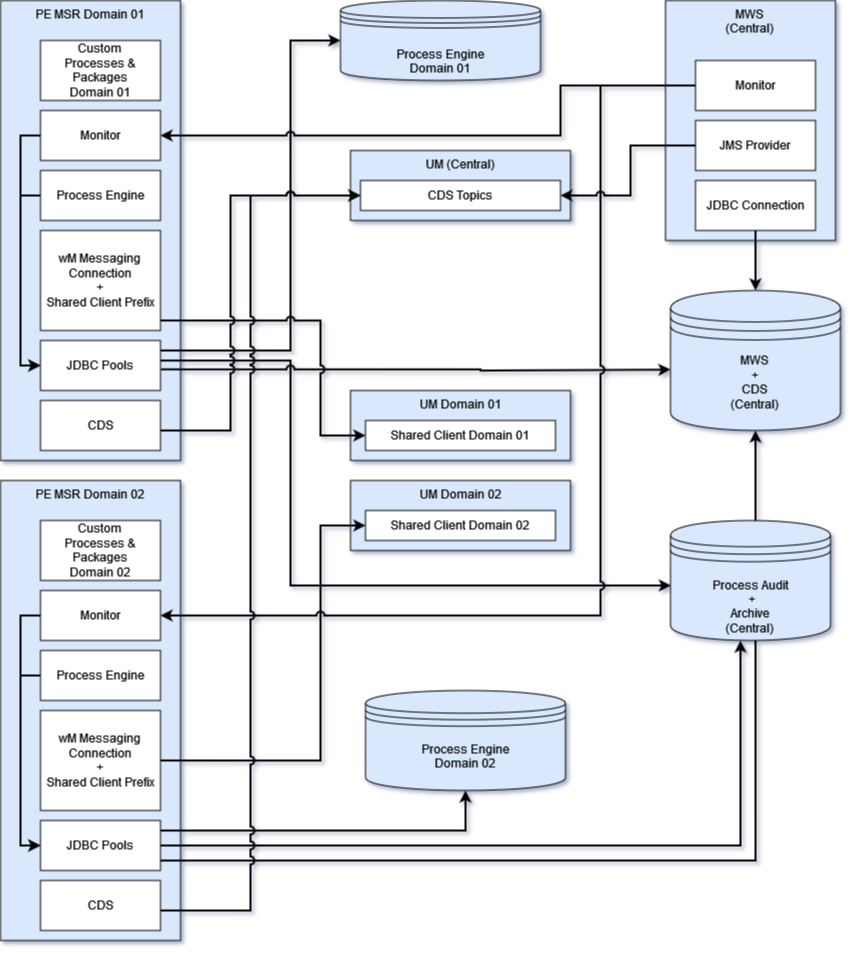

# BPM Demo

This demo project covers multiple scenarios to deploy all needed webMethods BPM components as container in a Kubernetes cluster. The webMethods components are

- Microservices Runtime (MSR)
- Process Engine (PE)
- My webMethods Server (MWS)
- Database
- Task Engine (TE)
- Universal Messaging (UM)

## BPM-01 Scenario - Using Business Domains with central UM

Following scenarios covers the setup for multiple business domains. In one business domain, there is a PE with executes and drives only a set of business processes.

- There is one central MWS for all business domains as monitor.
- Regarding re-submit, the monitor requires a connection to the MSR/monitor of business domain.
- There is one central UM for PE messaging in all domains and MWS clustering with Common Directory Service (CDS).
- TE is out of scope here.

This Scenario can be used if there aren't any UM messaging requirements. UM is used *only* by all PEs. Note, if UM is not available, all domains are offline.

## BPM-02 Scenario - Using Business Domains with separate UM

Following scenarios covers the setup for multiple business domains. In one business domain, there is a PE with executes and drives only a set of business processes.

- There is one central MWS for all business domains as monitor.
- Regarding re-submit, the monitor requires a connection to the MSR/monitor of business domain.
- There is one UM for MWS clustering with Common Directory Service (CDS)
- In each domain is an UM to serve the messaging in domain and for PE.
- TE is out of scope here.

The advantages of this scenario is, you can optimize and configure UM for each business domain. If a domain is not available, there isn't any dependency to another one.
