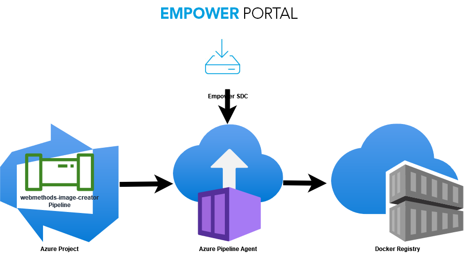

# webMethods Image Builder

## Introduction

This project provides 3 Azure pipelines to create Docker images for webMethods component products. The Azure pipelines are running inside already deployed Azure Pipelines Agent. 



The Software AG installer is used and called to create images. After creation, the image will be pushed to a remote Docker registry. This can be e.g. Harbor or Azure Container Registry so that Kubernetes can pulled from there.

There are 3 pipelines available and each uses the Installer to create the image in another way.

- `azure-pipelines.yml`: The Installer will be called with option `create container-image`. The entrypoint will be defined and set by Installer dependent on selected product. It can be only installed products which are ready for running inside container and supported by Installer
- `azure-pipelines-own-entrypoint.yaml`: This is so called *lagacy* version. A Dockerfile is created and after this, `docker build` will be called to create the image. During the build process, Installer will be called to install the products. The products will be installed in the old legacy fashion and you can install all available components. This way offers a parameter `entrypoint`. If the container is creating and starting, the entrypoint command is executed also. This and the next pipeline are often used to build images for webMethods tools and utilities such as Database Component Configurtor or Asset Build Environment.
- `azure-pipelines-lagacy.yml`: This is the *lagacy* version without entrypoint.

Installer will be called to install latest fixes automatically in all cases.

The pipelines have following parameters:

* `Tag`: Tag the created image with this name. The tag is used in local Docker registry and in remote.
* `List of product components`: A list of ID separated by comma. See section Hot to get product ID.
* `Release version`: Defines the release version of installed product components, e.g. `10.15`
* `Administrator password`: This administrator password will be configured into installed products.
* `ENTRYPOINT`: This parameter is available in `azure-pipelines-own-entrypoint.yaml` and sets the entrypoint in the order of image creation. Use `echo` as dummy entrypoint.
* `Base Image`: This base image is used to create the target image. In case of `azure-pipelines.yml`, the parameter is passed to Installer. In case of `azure-pipelines-own-entrypoint.yaml`, the `FROM` statement is used on building Docker image. Use can use `registry.access.redhat.com/ubi8/ubi:latest`.
* `Variable Group`: Use this parameter to parameterize the running pipeline with a set of variables grouped in a Variable Group. The default Variable Group is `webmethods-image-builder-vars`.

## Restrictions

There is no support of HTTP proxy settings. The connection to Internet must be direct.

## Base Image and azure-pipelines-own-entrypoint

In `azure-pipelines-own-entrypoint.yaml` is `docker build`  with `own-entrypoint/Dockerfile` used to build the image. `curl` will be used to download the Installer. Therefore, `curl` must be installed. Currently, `apt-get` is used as package manager. This package manager is available in the default image `ubuntu:latest`.

If you want to use another base image, check the available package manager and adopt `own-entrypoint/Dockerfile` regarding `curl` installation.

## Variable Group

The running pipeline needs additional parameters which are passed as Variable Group `webmethods-image-builder-vars` to the job. Create a Variable Group in the Azure project with following variables:

* `EMPOWER_USERNAME`: Your username to Empower login
* `EMPOWER_PASSWORD`: Your password to Empower login
* `INSTALLER_VERSION`: This installer is used to create images. Last know version is `20230614`.
* `REGISTRY_USERNAME`: Username to login into remote Docker registry for pushing image
* `REGISTRY_PASSWORD`: Password to login into remote Docker registry for pushing image
* `REGISTRY_HOST`: Hostname of remote Docker registry
* `REGISTRY_PROJECT`: Project or sub-folder where the image is pushed. At the end, the image is pushed to `${REGISTRY_HOST}/${REGISTRY_PROJECT}/${TAG}`.
* `AGENT_POOL`: Default is `wm-image-builder`. The running pipeline use the Agent Pool to address the registered agent for executing the pipeline.

**Tip:** If you plan to have multiple environments to build images, add the environment name to Variable Group name. The Variable Group name is requested on starting the pipeline.

## How to get Product IDs

There are 2 possibilities to retrieve the product IDs.

* Start Installer with option `-writeScript <script-file>` in interactive mode and let generate a script at the end after product components selection. You will find the IDs under key `products` in the file. The IDs are already comma separated. Remove prefix `e2ei/11/.*/.*/` occurrences to get the real product ID. (This will add by pipeline job automatically if needed)
* Use Command Central, connect the SDC product repository, browse through and copy IDs from selected components.

Sample product IDs:
* `MSC`: Microservces Runtime
* `integrationServer`: Integration Server (requires `centos:7|8` base image)
* `Monitor`: Integration Server WmMonitor package
* `PIEContainerExternalRDBMS`: Integration Server JDBC driver to connect to external databases
* `WmSAP`: wM SAP Adapter package
* `jdbcAdapter`: wM JDBC Adapter package
* `EntireXAdapter`: wM EntireX Adapater package
* `TaskEngineRuntime`: Task Engine in MWS
* `MWSPIETaskEngine`: Task Engine in IS
* `MwsProgramFiles`: My webMethods Server (requires `centos:7|8` base image)
* `wst`: Cloud Streams for [connectors](https://tech.forums.softwareag.com/c/webmethods-cloudstreams-connectors/76)

To install Database Component Configurator (for 10.15 and all DCC components), use the product IDs:

```
TNScdc,tppDB,WOKcdc,YAIcdc,MATcdc,tppAnt,WPEcdc,DatabaseComponentConfiguratorCore,WMNcdc,DatabaseComponentConfigurator,OBECentConfCdc,OBEcdc,tppServlet,MWScdc,WSTcdc,PIEEmbeddedCdc,PIEcdc,WSIddj,tppSpring
```

To install Deployer, use the product IDs:

```
Deployer,NUMDeployer,WSTDeployer,MSC
```

To install Asset Build Environment plus all product plug-ins (which are available in 10.15):

```
acdl,MATacdl,LJPacdl,YAIacdl,PLSacdl,WMDacdl,PIFacdl,WOKacdl,WSTacdl,SPMacdl,DEVacdl,EDAacdl,PIEacdl,MWSacdl,OBEacdl,TNSacdl,NUMacdl
```

Service Auditing:

```
MSC,PIEContainerExternalRDBMS,Monitor
```

My webMethods Server with base image `centos:7|8` as monitor:

```
MwsProgramFiles,monitorUI,optimizeSharedUI,optimizeUI,centralConfiguratorUI
```

Process Engine:

```
MSC,wmprt,PIEContainerExternalRDBMS,Monitor,TaskClientPackage
```

## [Deprecated] Running Azure Pipelines Agent in Kubernetes

*The access from running container inside Kubernetes to Docker (DinD) can be restricted in newer Kubernetes version. Therefore, check your Kubernetes distribution and maybe it is easier to run only Docker in your DevOps environment to build images.*

To start and run an Azure Pipeline, you need an Azure project. The pipelines must be assigned and for remote executing an Agent Pool e.g. `wm-image-builder`. 

The pipeline job can be executed in Kubernetes. This requires an running agent. The agent must know the Azure project. To do this, an agent pool `wm-image-builder` must exist. 

Use and prepare Helm to install ...

```
helm repo add emberstack https://emberstack.github.io/helm-charts
helm repo update
```

Full documentation about Azure Pipelines Agent are on <https://artifacthub.io/packages/helm/emberstack/azure-pipelines-agent>. Following Helm command installs the Agent and connects to the project.

```
helm upgrade --install azure-pipelines-agent emberstack/azure-pipelines-agent ^
 --set pipelines.url=https://dev.azure.com/wM-Inno-Container ^
 --set pipelines.pat.value=<Your-Personal-Access-Token> ^
 --set pipelines.agent.mountDocker=true ^
 --set pipelines.pool=wm-image-builder
```

**Note:** `pipelines.agent.mountDocker=true` allows the running pipeline job inside Docker container to connect to the Docker host/server.

**Note:** `wm-image-builder` must be set in variable `AGENT_POOL` of Variable Group.

**Note:** `<Your-Personal-Access-Token>` create the token in your profile

## Configure Azure Project for Agent Pool 

The Azure project must be configured regarding Agent Pool `wm-image-builder`. Go to your Project Settings > Pipelines > Agent pools and add a new pool called `wm-image-builder` with Pool type `Self-hosted`. After a short time, you should find an agent in menu `Agents` with the name which you have defined as release on command `helm upgrade --install <release-name> ...`.

**Tip:** If you have different locations or environments to build images, add the environment into the Agent Pool name. Also, you must set this name into `AGENT_POOL` variable.

## Inside Pipeline Job

The pipelines are so designed that *Docker-in-Docker* (DinD) is enabled. The job does following steps to build the image:

1. Download and install Docker CLI. 
2. Login to remote Docker registry (to validate the credential settings)
3. Download and install curl.
4. Download Installer from Empower.
5. Start Installer with downloading products and fixes from Empower SDC.
6. `docker build` is called to build the image.
7. Push created image to remote registry.
8. Remove created image in local registry.

